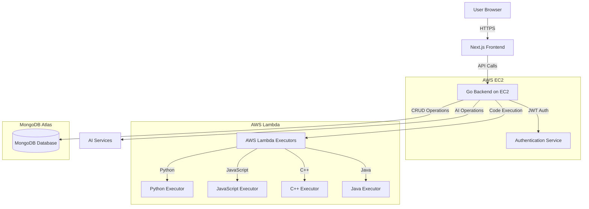
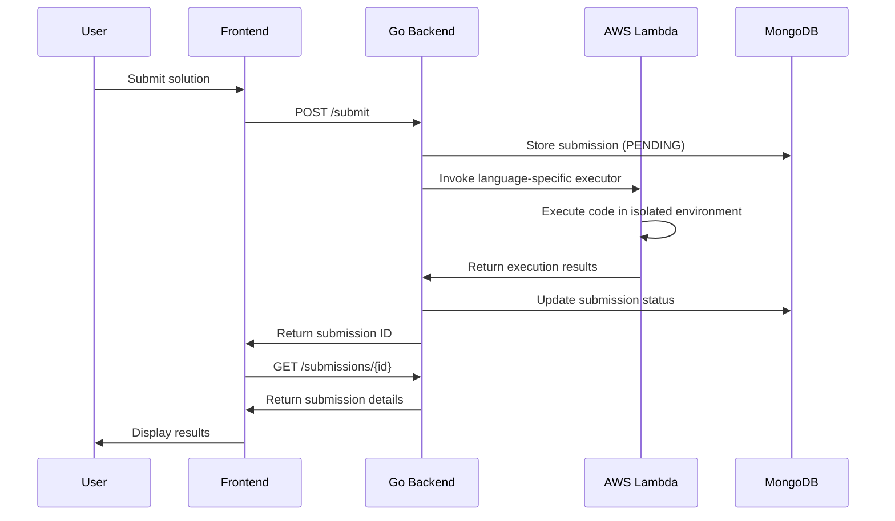
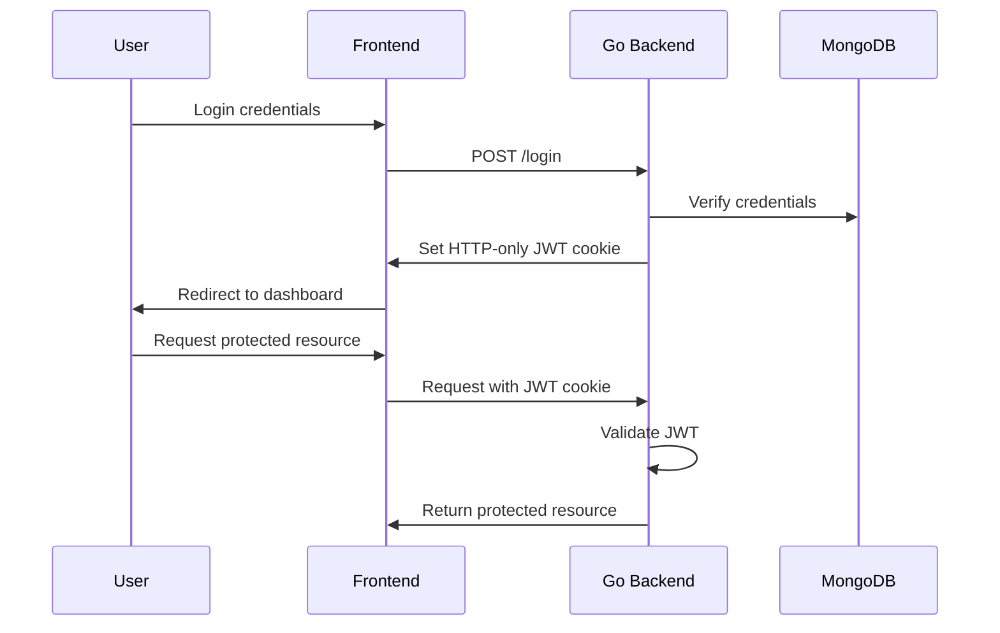
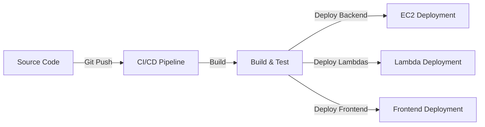
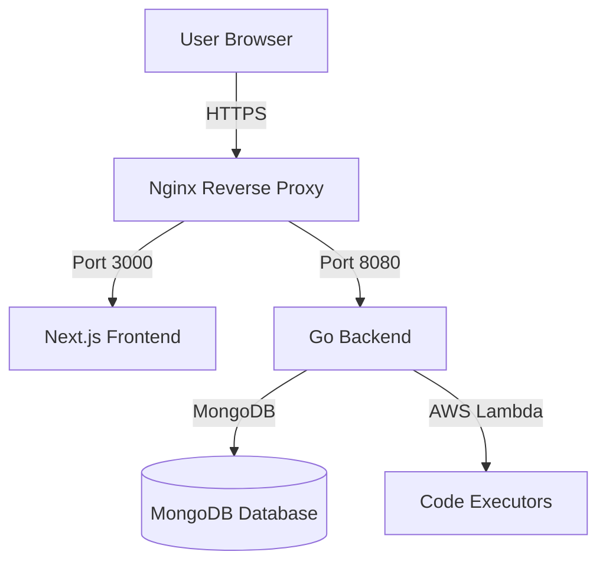

# codesorted (Online Judge)

This is an Online Judge platform for competitive programming practice. The platform supports multiple programming languages, real-time code execution, and automated evaluation of submissions with AI-driven coding features, addressing the need for
intelligent coding practice environments

## Features

- **User Authentication**: Register, login, and manage user profiles.
- **Social Login**: Sign in using Google, Facebook, or GitHub accounts
- **Guest Access**: Try the platform without registration using a guest account
- **Problem Solving**: Browse problems, write solutions, and submit them in multiple languages (Python, JavaScript, C++, Java).
- **AI-powered Code Completion**: Get intelligent code suggestions as you type.
- **AI-assisted Problem Creation**: Create well-structured problems with AI-generated problem statements, test cases, and metadata.
- **Judge System**: Automatic evaluation of submissions against test cases.
- **Discussion System**: Participate in discussions for each problem.
- **Admin Dashboard**: Manage problems, users, and submissions.
- **Code Editor**: Built-in Monaco editor with syntax highlighting
- **Multiple Languages**: Support for Python, JavaScript, C++, and Java
- **Real-time Execution**: Test your code with custom inputs before submission (via sandboxed language executors)
- **Automated Evaluation**: Submit solutions to be evaluated against test cases
- **Detailed Feedback**: Receive specific error messages and test case results
- **Submission History**: Track your progress and review past submissions
- **Pseudocode Support**: Convert pseudocode to Python for execution
- **AI Progressive Hints**: Receive progressive hints for problems, with the number of hints varying by difficulty (Easy: 1, Medium: 2, Hard: 3).
- **Rate Limiting**: Protection against excessive usage of AI-powered and resource-intensive services

## Getting Started

### Prerequisites

- Go 1.24+ for backend
- Node.js 16+ for frontend
- MongoDB instance

### Setup

1. Clone the repository
2. Set up environment variables in `backend/.env`:
   ```
   MONGO_URI=mongodb://localhost:27017
   JWT_SECRET_KEY=your_secret_key
   PORT=8080
   ```
3. Start the backend:
   ```bash
   cd backend
   go run cmd/server/main.go
   ```
4. Start the frontend:
   ```bash
   cd frontend
   npm install
   npm run dev
   ```

5. Build & start language-executor containers (Python, JS, C++, Java)
   ```bash
   cd docker  # contains docker-compose.yml and language executors
   docker compose up --build -d  # builds images and starts on ports 8001-8004
   ```

6. (Re)start the backend & frontend as usual. The backend now delegates code execution to those containers.

## Creating an Admin User

To create an admin user, run the following command from the root directory of the project:

```bash
./create_admin.sh <firstname> <lastname> <username> <password>
```
Replace `<firstname>`, `<lastname>`, `<username>`, and `<password>` with the desired details for your admin user.

## Error Classification

The platform intelligently classifies errors to provide helpful feedback:

- **Compilation Errors**: Syntax errors, name errors, and other code structure issues
- **Runtime Errors**: Errors that occur during execution (e.g., division by zero)
- **Time Limit Exceeded**: Solutions that take too long to execute
- **Memory Limit Exceeded**: Solutions that use too much memory
- **Wrong Answer**: Solutions that produce incorrect output for test cases

## Architecture

- **Backend**: Go REST API with JWT authentication and MongoDB integration
- **Frontend**: Next.js application with React, TypeScript, and Tailwind CSS
- **Code Execution**: Sandboxed environment for safe code execution, powered by per-language Docker micro-services

## New API (June 2025)

| Endpoint | Method | Description |
|----------|--------|-------------|
| `/last-code` | GET | Retrieve the most recent code draft for the authenticated user for a given `problem_id` (and optional `language`). |
| `/convert-code` | POST | Convert pseudocode to Python code. |
| `/api/rate-limits` | GET | Get current rate limit status and remaining usage for the authenticated user. |
| `/api/admin/rate-limits` | PUT/POST | Admin endpoint to update rate limits for a specific user. |

The frontend now uses this endpoint to repopulate the Monaco editor when you revisit a problem page, falling back to `localStorage` first.

## Rate Limiting

The platform includes rate limiting for resource-intensive services:

- **Code Completion**: Limits on AI-powered code suggestion requests
- **Pseudocode Conversion**: Limits on pseudocode to Python conversion 
- **Code Execution**: Limits on code execution requests
- **Code Submission**: Limits on solution submissions
- **Guest Account Creation**: Limited to 3 accounts per hour per IP address

Rate limits are set per service and reset hourly. Regular users and administrators have different limit thresholds. The API returns appropriate HTTP headers to track usage:

- `X-RateLimit-Limit`: Maximum requests allowed per hour
- `X-RateLimit-Remaining`: Remaining requests in the current window
- `X-RateLimit-Reset`: Time when the rate limit window resets (ISO 8601 format)

When a rate limit is exceeded, the API returns a 429 Too Many Requests status code.

## New Problem Creation Feature (June 2025)

### Overview
The platform now supports user-created problems with AI-powered test case generation. This feature allows any logged-in user to:

1. Create new programming problems with a UI similar to the problem-solving page
2. Generate test cases automatically using AI based on the problem statement
3. Preview the problem before submission
4. Specify sample test cases that will be visible to problem solvers

### Usage
1. Navigate to the "Create Problem" option on the home page or problems list
2. Fill in the problem details (ID, title, statement, constraints, etc.)
3. Click "Generate Problem" to get the structured problem details.
4. Click "Generate Test Cases" to create test data using AI, associated with the problem ID.
5. Review and adjust the test cases as needed (inputs now support 'key = value' format).
6. Click "Create Problem" to finalize and publish the problem

### Features
- Open to all registered users
- Editable problem form with real-time preview
- AI-powered test case generation using the problem statement
- Support for Python expressions in test cases for generating large datasets
- Customizable number of sample test cases visible to users

### API Endpoints
| Endpoint | Method | Description |
|----------|--------|-------------|
| `/admin/problems` | POST | Create a new problem |
| `/api/generate-problem-details` | POST | Generate structured problem details from a raw statement. |
| `/api/generate-testcases` | POST | Generate test cases from a problem statement and problem ID. |
| `/api/bulk-add-testcases` | POST | Add multiple test cases to a problem |

### Implementation
The feature uses the Gemini AI model to analyze problem statements and generate diverse test cases across different difficulty levels, including edge cases and stress tests. Test case inputs can now be provided and displayed in a human-readable `key = value` format, which is internally converted to JSON for backend processing.

## Contribution

Contributions are welcome! Please feel free to submit a Pull Request.

## Authentication System

The authentication system uses JWT tokens stored in HTTP-only cookies for secure user sessions.

### Authentication Flow

1. **Login/Registration**: When a user logs in or registers, the server generates a JWT token and sets it as an HTTP-only cookie.
2. **Social Login**: Users can sign in with Google, Facebook, or GitHub accounts.
3. **Guest Access**: Users can create temporary guest accounts for trying the platform.
4. **Auth Status**: The client can check the user's authentication status using the `/api/auth-status` endpoint.
5. **Logout**: Logout properly invalidates the cookie both on the server and client side.

### Authentication Components

- **Backend Handlers**: 
  - `LoginHandler`: Validates credentials and sets JWT cookie
  - `LogoutHandler`: Invalidates JWT cookie
  - `AuthStatusHandler`: Checks JWT validity and returns user info
  - `OAuthLoginHandler`: Initiates OAuth flow with providers
  - `OAuthCallbackHandler`: Handles OAuth provider callbacks
  - `GuestLoginHandler`: Creates temporary guest accounts
  
- **Frontend Components**:
  - `useAuth` hook: Centralized auth state management
  - `AuthContext`: React context for sharing auth state
  - `AuthProvider`: Provider component that wraps the application
  
### OAuth Configuration

To enable social login, set the following environment variables in the backend `.env` file:

```
# Google OAuth
GOOGLE_CLIENT_ID=your_google_client_id
GOOGLE_CLIENT_SECRET=your_google_client_secret

# Facebook OAuth
FACEBOOK_CLIENT_ID=your_facebook_client_id
FACEBOOK_CLIENT_SECRET=your_facebook_client_secret

# GitHub OAuth
GITHUB_CLIENT_ID=your_github_client_id
GITHUB_CLIENT_SECRET=your_github_client_secret

# Base URL for OAuth redirects
OAUTH_REDIRECT_BASE_URL=http://localhost:8080
```

You'll need to create OAuth applications on the respective platforms and configure the callback URLs as:
- Google: `http://localhost:8080/auth/callback/google`
- Facebook: `http://localhost:8080/auth/callback/facebook`
- GitHub: `http://localhost:8080/auth/callback/github`

**Important Note for GitHub OAuth**: Ensure the "Authorization callback URL" configured in your GitHub OAuth application settings (found under "Developer settings" -> "OAuth Apps" on GitHub) *exactly matches* the `OAUTH_REDIRECT_BASE_URL` from your `.env` file combined with the `/auth/callback/github` path. A mismatch will result in a "redirect_uri is not associated with this application" error.

# Frontend URL for OAuth Redirects
FRONTEND_URL=http://localhost:3000
```

The FRONTEND_URL environment variable specifies where users should be redirected after a successful OAuth login. Make sure this points to your running frontend application.

### Security Measures

- JWT tokens are stored in HTTP-only cookies to prevent JavaScript access
- Secure flag ensures cookies are only sent over HTTPS
- SameSite policy for CSRF protection
- Proper cookie expiration handling
- CSRF protection for OAuth flows using state parameters
- Rate limiting for guest account creation (3 per hour per IP)

### Recent Fixes

- Fixed logout functionality to properly invalidate cookies
- Implemented client-side cookie clearing as a fallback
- Added route change detection to refresh auth status on navigation
- Centralized auth state management using React Context
- Improved submissions search functionality to include problem name and fixed filtering issues
- Removed problem ID search, only problem name search is available for submissions
- Implemented client-side caching for responses from `/problems`, `/problems/{id}`, and `/problems/{id}/stats` endpoints, with a cache lifetime of 5 minutes.

## AI Features

The platform integrates several AI-powered features:

1. **Code Complexity Analysis**: Automatically analyze the time and memory complexity of submitted code.
2. **Pseudocode to Python Conversion**: Convert pseudocode to runnable Python code.
3. **Intelligent Code Completion**: Get context-aware code suggestions as you type.
4. **Progressive Hints**: Receive guided hints when stuck on a problem.
5. **AI-assisted Problem Creation**: Generate well-structured problems from a simple description, including:
   - Formatted problem statements with examples
   - Appropriate difficulty level and tags
   - Problem constraints
   - Test cases (both sample and hidden)

## High-Level Design Document: Cloud Architecture

### 🚀 TLDR
This document outlines the architecture of our cloud-based Online Judge platform with a Go backend deployed on EC2 and language executors on AWS Lambda, providing a scalable, secure solution for running user code submissions.

### 1. System Architecture Overview



### 2. Component Breakdown

#### 2.1 Frontend (Next.js)
- **Technology**: Next.js, React 19, TypeScript, Tailwind CSS
- **Key Features**:
  - User authentication with JWT and social login options
  - Problem browsing and filtering
  - Monaco code editor with syntax highlighting
  - Submission history and analytics
  - User profiles with achievement badges and ranking
  - Admin dashboard for problem management

#### 2.2 Backend (Go on EC2)
- **Technology**: Go 1.24+, MongoDB driver, JWT authentication
- **Deployment**: AWS EC2 instance with Nginx as reverse proxy
- **Key Components**:
  - RESTful API endpoints
  - JWT-based authentication with HTTP-only cookies
  - Rate limiting for resource-intensive operations
  - Problem and submission management
  - User statistics tracking
  - Integration with AWS Lambda for code execution

#### 2.3 Code Execution System (AWS Lambda)
- **Architecture**: Serverless functions for each supported language
- **Supported Languages**:
  - Python (Lambda function)
  - JavaScript (Lambda function)
  - C++ (Lambda function)
  - Java (Lambda function)
- **Security Features**:
  - Isolated execution environments
  - Resource constraints (memory, CPU)
  - Execution timeouts
  - Input sanitization

#### 2.4 Database (MongoDB)
- **Deployment**: MongoDB Atlas or self-hosted MongoDB
- **Collections**:
  - `users`: User accounts and authentication data
  - `problems`: Problem statements, constraints, and metadata
  - `testcases`: Test cases for problems
  - `submissions`: User code submissions and evaluation results
  - `problem_stats`: Aggregated statistics for problems
  - `user_stats`: Problem-solving statistics for users
  - `profiles`: User profile information including achievements

#### 2.5 AI Integration
- **Features**:
  - Code complexity analysis
  - Pseudocode to Python conversion
  - Intelligent code completion
  - Progressive hints system
  - AI-assisted problem creation

### 3. Data Flow

#### 3.1 Code Submission and Execution Flow


#### 3.2 Authentication Flow


### 4. AWS Infrastructure

#### 4.1 EC2 Configuration
- **Instance Type**: t2.medium (recommended minimum)
- **OS**: Amazon Linux 2023 or Ubuntu Server LTS
- **Security Groups**:
  - Allow HTTP/HTTPS (ports 80/443)
  - Allow SSH (port 22) with restricted IPs
- **Storage**: 20GB+ EBS volume
- **Networking**: Public subnet with Elastic IP

#### 4.2 Lambda Configuration
- **Python Executor**:
  - Runtime: Python 3.11
  - Memory: 256MB
  - Timeout: 10 seconds
  - Layers: Required Python packages
  
- **JavaScript Executor**:
  - Runtime: Node.js 18.x
  - Memory: 256MB
  - Timeout: 10 seconds
  
- **C++ Executor**:
  - Runtime: Custom runtime (Amazon Linux 2)
  - Memory: 512MB
  - Timeout: 15 seconds
  
- **Java Executor**:
  - Runtime: Java 17
  - Memory: 512MB
  - Timeout: 15 seconds

#### 4.3 Security Configuration
- **VPC**: Private subnet for Lambda functions
- **IAM Roles**:
  - EC2 role with Lambda invocation permissions
  - Lambda execution roles with minimal permissions
- **API Gateway**: Optional for direct Lambda access
- **CloudWatch**: Logging and monitoring

### 5. Deployment Pipeline



#### 5.1 Backend Deployment Steps
1. Build Go application
2. Run tests
3. Create systemd service file
4. Configure Nginx as reverse proxy
5. Set up SSL with Let's Encrypt
6. Configure environment variables
7. Start application

#### 5.2 Lambda Deployment Steps
1. Package code for each language executor
2. Configure environment variables
3. Set resource limits
4. Deploy to AWS Lambda
5. Configure IAM permissions

### 6. Scaling Considerations

#### 6.1 Horizontal Scaling
- **EC2**: Auto Scaling Group for backend instances
- **Lambda**: Automatic scaling by AWS
- **Load Balancer**: Application Load Balancer for multiple EC2 instances

#### 6.2 Database Scaling
- **Sharding**: Distribute data across multiple MongoDB instances
- **Indexing**: Proper indexes for frequent queries
- **Caching**: Redis for frequently accessed data

### 7. Monitoring and Logging

#### 7.1 AWS CloudWatch
- **Metrics**: CPU, memory, network usage
- **Alarms**: Set up for critical thresholds
- **Logs**: Centralized logging for EC2 and Lambda

#### 7.2 Application Monitoring
- **Health Checks**: Endpoint for system status
- **Error Tracking**: Centralized error logging
- **Performance Metrics**: Execution times, memory usage

### 8. Cost Optimization

#### 8.1 EC2 Optimization
- **Reserved Instances**: For predictable workloads
- **Spot Instances**: For non-critical components
- **Right-sizing**: Match instance type to workload

#### 8.2 Lambda Optimization
- **Memory Allocation**: Optimize based on execution requirements
- **Execution Duration**: Minimize cold starts
- **Concurrency**: Set appropriate limits

### 9. Future Enhancements

#### 9.1 Technical Improvements
- **CDN Integration**: CloudFront for static assets
- **Multi-region Deployment**: For global availability
- **Containerization**: Docker and ECS/EKS for better isolation
- **GraphQL API**: For more efficient data fetching

#### 9.2 Feature Roadmap
- **Real-time Collaboration**: Collaborative code editing
- **Contest System**: Timed coding competitions
- **Advanced Analytics**: ML-based performance insights
- **Mobile Application**: Native mobile experience

## Deployment

### Server Architecture

The Online Judge platform is deployed with the following architecture:



- **Nginx**: Acts as a reverse proxy, handling SSL termination and routing requests
- **Next.js Frontend**: Runs as a standalone server on port 3000
- **Go Backend**: Runs on port 8080 with HTTPS support
- **MongoDB**: Database for storing problems, submissions, users, etc.
- **AWS Lambda**: Serverless functions for executing code in different languages

### HTTPS Configuration

The platform is configured to use HTTPS for secure communication:

1. SSL certificates are obtained through Let's Encrypt/Certbot
2. Nginx handles SSL termination for the frontend
3. The Go backend also supports HTTPS with proper certificate configuration
4. All cookies are set with Secure and HttpOnly flags

### Deployment Process

A CI/CD pipeline is implemented using the `deploy.sh` script, which:

1. Builds the Go backend and Next.js frontend locally
2. Transfers compiled binaries and assets to the EC2 instance
3. Restarts the necessary services (backend.service and PM2-managed Next.js)
4. Verifies the deployment status

To deploy updates to the platform:

```bash
./deploy.sh
```

This script requires SSH access to the EC2 instance and appropriate permissions.

### Server Setup

The backend is managed as a systemd service with the following configuration:

```ini
[Unit]
Description=Go Backend Service
After=network.target

[Service]
User=ec2-user
WorkingDirectory=/home/ec2-user/backend
Environment="PORT=8080"
Environment="AWS_REGION=ap-south-1"
Environment="SSL_CERT_FILE=/home/ec2-user/backend/certs/codesorted.com.crt"
Environment="SSL_KEY_FILE=/home/ec2-user/backend/certs/codesorted.com.key"
Environment="USE_HTTPS=true"
ExecStart=/home/ec2-user/backend/server
Restart=always
RestartSec=5
StandardOutput=journal
StandardError=journal

[Install]
WantedBy=multi-user.target
```

The frontend is managed using PM2 to ensure it stays running and restarts on system boot.

For detailed deployment instructions and troubleshooting, refer to the `commands.md` file.
